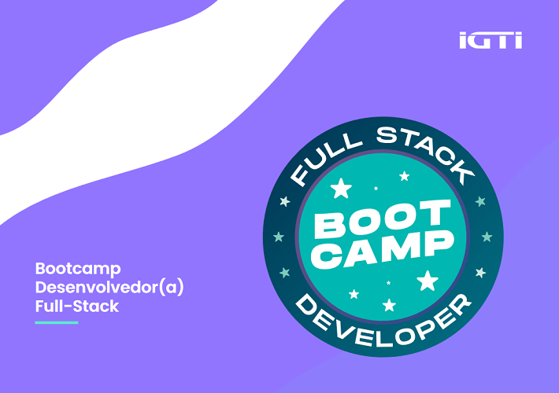
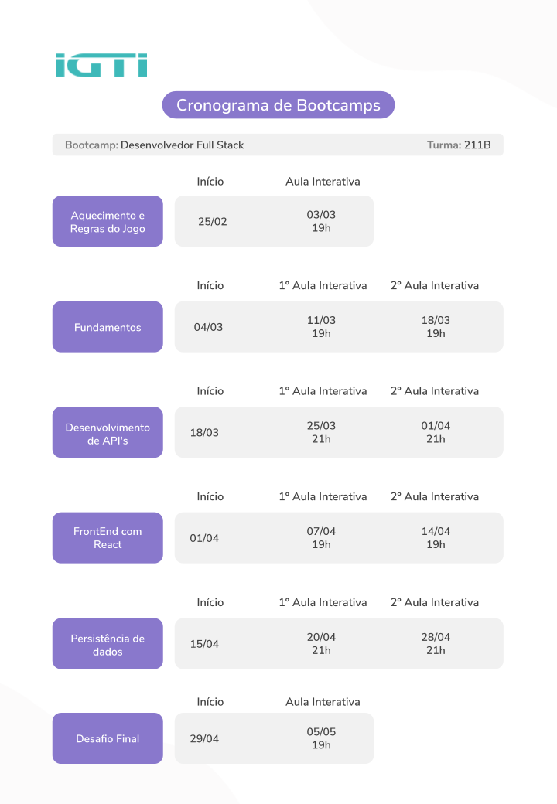

  

# Bootcamp - Desenvolvedor(a) Full Stack

O Bootcamp tem como objetivo oferecer uma formação prática e intensiva que habilite o profissional para atuar como desenvolvedor(a) Full Stack.

### Cronograma

  

### :book: Módulos

##### Módulo 1: Fundamentos

- Introdução ao JavaScript, instruções, tipos, valores, variáveis e comentários.
- Comandos de bloco: estruturas de decisão, estruturas de repetição, funções e manipulação de eventos.
- JavaScript moderno (ES6+): arraymethods, rest/spread operatore destructuring.
- JavaScript assíncrono: setTimeout, setInterval, requisições HTTP, promisese async/await

##### Módulo 2: Desenvolvimento de API's

- Introdução ao Node.js, Express.js, EventLoop, módulos e ferramentas.
- Rotas, middlewares, tratamento de erros, utilização de logs e arquivos estáticos.
- Verbos HTTP: POST, GET, PUT e DELETE.
- Criação e documentação de API’s.

##### Módulo 3: Front-end com react

- Introdução ao React, VirtualDOM, create-react-appe JavaScript puro x React.
- Class Components, props, state, setState, Lifecycle, Methods e trabalhando com eventos.
- Functional components, props destructuring, closures e conversão a partir de Class Components.
- React Hooks, useState, useEffect, deps e conversão a partir de Class Components.

##### Módulo 4: Persistência de dados, versionamento de código e implantação

- MongoDB, coleções, CRUD, BulkWrite, índices, modelagem e agregações.
- Introdução ao MongoDBAtlas, características e utilização do serviço e integração com APIs.
- Git, instalação e configuração do Git, principais comandos e introdução ao GitHub.
- Introdução ao Heroku, instalação e utilização do HerokuCLI e implantação de apps com o Heroku

##### Módulo 5: Desfio Final

- Criar uma aplicação utilizando todos os conceitos vistos e estudados nos 4 módulos.

### :video_camera: Vídeo Aulas

##### Módulo 1: Fundamentos

Capítulo 1 – Visual Studio Code

- Introdução ao Visual Studio Code (parte I)[Link](https://youtu.be/2Xqx3uXqgmU)
- Introdução ao Visual Studio Code (parte II)[Link](https://youtu.be/rC0-gG6P5OM)

Capítulo 2 – Node.js

- Introdução ao Node.js[Link](https://youtu.be/MXRDbzYjRCc)
- Introdução ao NPM e à biblioteca live-server[Link](https://youtu.be/S5CKWihvEYA)

Capítulo 3 – HTML

- Noções de HTML (parte I)[Link](https://youtu.be/ltWg17lBFaI)
- Noções de HTML (parte II)[Link](https://youtu.be/W9IGnR_ZfDA)

Capítulo 4 – CSS

- Noções de CSS (parte I)[Link](https://youtu.be/X_KHZg7mAY0)
- Noções de CSS (parte II)[Link](https://youtu.be/aCTzkB_MgHY)

Capítulo 5 – JavaScript

- Introdução ao JavaScript[Link](https://youtu.be/y-KcPjI_3aM)
- JavaScript básico (parte I)[Link](https://youtu.be/CSaNMq8Pkq0)
- JavaScript básico (parte II)[Link](https://youtu.be/yMxvsSILI5I)

Capítulo 6 – JavaScript: comandos de bloco

- Estruturas de decisão[Link](https://youtu.be/iIXaMOGIYkA)
- Estruturas de repetição[Link](https://youtu.be/demV3B7_Ux4)
- Funções[Link](https://youtu.be/yoSP2WLy0jo)

Capítulo 7 – DOM

- Manipulando o DOM com JavaScript[Link](https://youtu.be/ze052_oDzSs)
- Manipulando o CSS com JavaScript[Link](https://youtu.be/UWxPxKrE0lw)

Capítulo 8 – JavaScript: formulários e manipulação de eventos

- Introdução aos formulários HTML[Link](https://youtu.be/yiUbThn1Ahk)
- Manipulação de eventos com JavaScript[Link](https://youtu.be/UPh1Sm8gbJk)

Capítulo 9 – Desafio guiado: CRUD com HTML, CSS e JavaScript

- Desafio (parte I)[Link](https://youtu.be/wehiEUuZzMQ)
- Desafio (parte II)[Link](https://youtu.be/G5vzouNSgPs)
- Desafio (parte III)[Link](https://youtu.be/Go9VxbDnGZQ)
- Desafio (parte IV)[Link](https://youtu.be/v3sBk8kxnA8)

##### Módulo 2: Desenvolvimento de API's

Capítulo 1 – Introdução

- Backend vs Frontend[Link](https://youtu.be/dbKtndRiBU8)
- APIs[Link](https://youtu.be/Uhsn1u3irz4)
- Node.js[Link](https://youtu.be/JhqW3Y56YIc)
- Hello World Nodejs[Link](https://youtu.be/Am-ww4TBw8w)
- Node.js Event Loop[Link](https://youtu.be/xZFrpWVvgWI)
- Módulos do Node.js
  - [Link](https://youtu.be/6uXx-0Wjg8c)
  - [Link](https://youtu.be/uLFsrIjYdfU)
  - [Link](https://youtu.be/JvAJLosvBog)
  - [Link](https://youtu.be/ejsir-ri-aQ)
  - [Link](https://youtu.be/cuXW2h5Rg30)
  - [Link](https://youtu.be/n2fhldAIBgQ)
- Ferramentas para consumo de endpoints[Link](https://youtu.be/rmEIjVLBMP0)

Capítulo 2 - Express

- Instalação[Link]()
- Middlewares[Link]()
- Tratamento de erros[Link]()
- Gravação de logs[Link]()
- Servindo arquivos estáticos[Link]()

Capítulo 3 - Construção de uma API

- Grades Control API[Link]()
- Configuração do projeto[Link]()
- Método POST[Link]()
- Método GET[Link]()
- Método GET por id[Link]()
- Método DELETE[Link]()
- Método PUT[Link]()
- Tratamento de erros[Link]()
- Gravação de logs[Link]()
- Validação de campos[Link]()
- Cors[Link]()

##### Módulo 3: Front-end com react

Em andamento . . .

##### Módulo 4: Persistência de dados, versionamento de código e implantação

Em andamento . . .

##### Módulo 5: Desfio Final

Em andamento . . .

### :newspaper: Código Fonte Módulos

##### Módulo 1: Fundamentos

- [Aula01](https://github.com/gpd38/cursoIgtiBootcampFullStack/tree/master/modulo1/aula01)
- [Aula02](https://github.com/gpd38/cursoIgtiBootcampFullStack/tree/master/modulo1/aula02)
- [Aula03](https://github.com/gpd38/cursoIgtiBootcampFullStack/tree/master/modulo1/aula03)
- [Aula04](https://github.com/gpd38/cursoIgtiBootcampFullStack/tree/master/modulo1/aula04)
- [Aula05](https://github.com/gpd38/cursoIgtiBootcampFullStack/tree/master/modulo1/aula05)
- [Aula06](https://github.com/gpd38/cursoIgtiBootcampFullStack/tree/master/modulo1/aula06)
- [Aula07](https://github.com/gpd38/cursoIgtiBootcampFullStack/tree/master/modulo1/aula07)
- [Aula08](https://github.com/gpd38/cursoIgtiBootcampFullStack/tree/master/modulo1/aula08)
- [Aula09](https://github.com/gpd38/cursoIgtiBootcampFullStack/tree/master/modulo1/aula09)
- [Aula10](https://github.com/gpd38/cursoIgtiBootcampFullStack/tree/master/modulo1/aula10)
- [Aula11](https://github.com/gpd38/cursoIgtiBootcampFullStack/tree/master/modulo1/aula11)
- [Aula12](https://github.com/gpd38/cursoIgtiBootcampFullStack/tree/master/modulo1/aula12)
- [Aula13](https://github.com/gpd38/cursoIgtiBootcampFullStack/tree/master/modulo1/aula13)
- [Aula14](https://github.com/gpd38/cursoIgtiBootcampFullStack/tree/master/modulo1/aula14)
- [Aula15](https://github.com/gpd38/cursoIgtiBootcampFullStack/tree/master/modulo1/aula15)
- [Aula16](https://github.com/gpd38/cursoIgtiBootcampFullStack/tree/master/modulo1/aula16)
- [Aula17](https://github.com/gpd38/cursoIgtiBootcampFullStack/tree/master/modulo1/aula17)
- [Desafio](https://github.com/gpd38/cursoIgtiBootcampFullStack/tree/master/modulo1/desafio1)

##### Módulo 2: Desenvolvimento de API's

##### Módulo 3: Front-end com react

##### Módulo 4: Persistência de dados, versionamento de código e implantação

##### Módulo 5: Desfio Final

### :man_teacher: Professores

<table>
  <tr>
    <td></td>
    <td></td>
    <td></td>
  </tr>
  <tr>
    <td>Bruno Augusto Teixeira</td>
    <td>Guilherme Henrique de Assis</td>
    <td>Raphael Ribeiro Gomide</td>
  </tr>
</table>

### :books: Bibliografia Complementar

1. [Shields](https://shields.io/)
2.
3.
