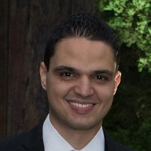
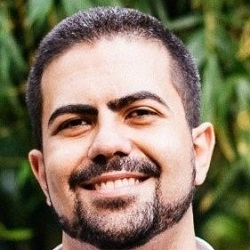

# Bootcamp - Desenvolvedor(a) Full Stack

O Bootcamp tem como objetivo oferecer uma formação prática e intensiva que habilite o profissional para atuar como desenvolvedor(a) Full Stack.

### Cronograma

  

##### Módulo 1: Fundamentos

##### Módulo 2: Desenvolvimento de API's

##### Módulo 3: Front-end com react

##### Módulo 4: Persistência de dados, versionamento de código e implantação

### Professores

<table width:100%>
  <tr>
    <td>Bruno</td>
    <td>Guilherme</td>
    <td>Raphael</td>
  </tr>
  <tr>
    <td>[Linkedin]()</td>
    <td>[Linkedin]()</td>
    <td>[Linkedin]()</td>
  </tr>
  <tr>
    <td></td>
    <td></td>
    <td></td>
  </tr>
</table>

### Bibliografia
